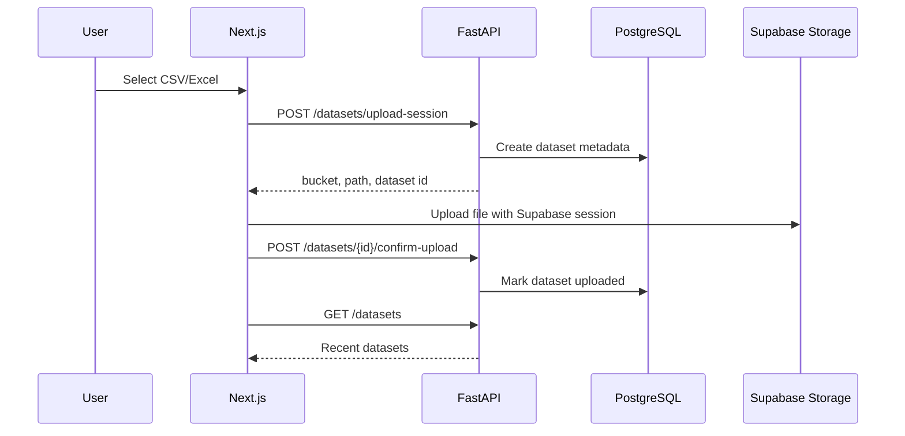

# STEP 4 File Upload

## Design Intent

STEP 4 implements file upload as a production SaaS workflow instead of sending
files through the API process. The backend creates trusted dataset metadata and a
storage path. The browser uploads directly to Supabase Storage with the user's
Supabase session. The backend then confirms the upload and marks the dataset as
`uploaded`.

This keeps FastAPI out of the large-file data path and gives us a clean upgrade path
for signed uploads, background parsing, large-file chunking, and async job status.

## Flow



## Backend

Added:

- `POST /api/v1/datasets/upload-session`
- `POST /api/v1/datasets/{dataset_id}/confirm-upload`
- `GET /api/v1/datasets`
- Dataset schemas.
- Dataset service layer.
- Dataset repository layer.
- Dataset migration: `infra/postgres/002_datasets.sql`.

The upload session endpoint validates:

- Supported extensions: `.csv`, `.xls`, `.xlsx`.
- Supported content types, including `application/octet-stream` for browsers that
  omit spreadsheet MIME types.
- Maximum upload size from `MAX_UPLOAD_SIZE_BYTES`.
- Workspace membership.

The storage path format is:

```text
{workspace_id}/{user_id}/{dataset_id}/{safe_filename}
```

This makes object ownership auditable and allows Supabase Storage policies to check
the user id segment.

## Frontend

Added:

- Dataset upload card on the main workspace screen.
- File selection UI.
- Client-side file validation.
- Upload loading states.
- Toast success and error handling.
- Recent datasets list with skeleton and empty state.

The browser upload uses:

```ts
supabase.storage.from(bucket).upload(path, file);
```

No service-role key is exposed to the browser.

## Supabase Storage

Storage setup SQL lives in:

```text
infra/supabase/storage-policies.sql
```

The policies assume the object path format above and allow authenticated users to
manage objects where the second folder segment equals `auth.uid()`.

## Environment

```dotenv
SUPABASE_STORAGE_BUCKET=datasets
MAX_UPLOAD_SIZE_BYTES=26214400
NEXT_PUBLIC_MAX_UPLOAD_SIZE_BYTES=26214400
```

## Validation

Local validation without Supabase credentials:

- Upload UI renders on the homepage.
- Empty state explains that Supabase env vars must be configured.
- Frontend lint/build pass.
- Backend health and protected route behavior remain correct.

Full upload validation requires:

- Supabase Auth configured.
- Supabase Storage bucket and policies applied.
- PostgreSQL auth and dataset migrations applied.

## Next Step

STEP 5 is CSV parsing:

- Read uploaded file metadata.
- Download file from Supabase Storage.
- Parse CSV with pandas.
- Generate preview rows.
- Infer column types.
- Detect missing values.
- Persist basic dataset profile.
