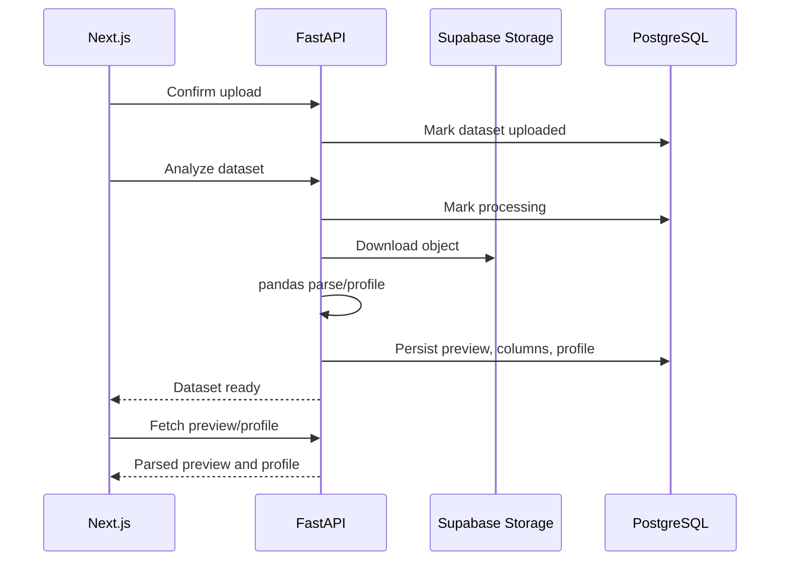

# STEP 5 CSV Parsing

## Design Intent

STEP 5 adds deterministic data profiling before any AI work. AI should receive
structured facts instead of guessing from raw files. The backend downloads the
uploaded object from Supabase Storage, parses it with pandas, stores a preview,
infers column types, and persists a reusable dataset profile.

The implementation stays synchronous for now so the workflow is simple to validate.
STEP 10 will move the same service into Celery for long-running files.

## Backend

Added:

- `POST /api/v1/datasets/{dataset_id}/analyze`
- `GET /api/v1/datasets/{dataset_id}/preview`
- `GET /api/v1/datasets/{dataset_id}/profile`
- Supabase Storage downloader.
- pandas-based dataset profiler.
- Dataset analysis migration:
  - `dataset_columns`
  - `dataset_profiles`
  - `dataset_previews`

Migration file:

```text
infra/postgres/003_dataset_analysis.sql
```

## Analysis Capabilities

The deterministic profiler currently supports:

- CSV parsing.
- Excel parsing.
- Duplicate column-name normalization.
- Preview row generation.
- Field type inference.
- Semantic hints for email, id, time, and currency-like columns.
- Missing value detection.
- Numeric summaries.
- Quartiles.
- IQR outlier detection.
- Correlation pairs.
- Time-series date range detection.
- Categorical aggregation candidates.

## Data Flow



## Frontend

Added:

- Upload flow now calls analyze after confirm.
- Ready datasets can display parsed preview rows.
- Profile summary shows row/column counts.
- Column chips show inferred data types.
- Loading skeleton for profile/preview fetch.

## Current Boundaries

- Full end-to-end parsing requires real Supabase credentials and Storage policies.
- Large file processing remains synchronous only temporarily.
- Worker-based processing starts in STEP 10.
- STEP 6 will use persisted profile data to generate chart recommendations.

## Next Step

STEP 6 is automatic chart generation:

- Rule-based chart recommendation from dataset profile.
- Chart config schema.
- Recharts rendering.
- Persist generated chart candidates.
