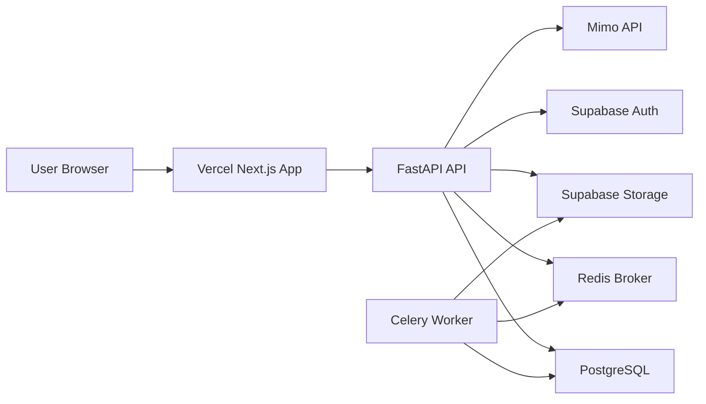

# STEP 12: Deployment

## Goal

This step prepares AI Data Analysis for real deployment with:

- Vercel frontend.
- Railway or Render backend.
- PostgreSQL.
- Redis.
- Celery worker.
- Supabase Auth and Storage.
- repeatable database migrations.

## Architecture



## Deployment Artifacts

Added or updated:

- `vercel.json`
- `render.yaml`
- `.env.production.example`
- `scripts/apply_postgres_migrations.py`
- `infra/docker/Dockerfile.api`
- `infra/docker/Dockerfile.web`

The API image includes the SQL migrations and migration script so one-off
deployment jobs can run the same migration flow as local environments.

## Production Environment Variables

Backend:

- `APP_ENV=production`
- `LOG_LEVEL=info`
- `DATABASE_URL`
- `REDIS_URL`
- `CORS_ORIGINS=["https://your-vercel-app.vercel.app"]`
- `SUPABASE_URL`
- `SUPABASE_PUBLISHABLE_KEY`
- `SUPABASE_SERVICE_ROLE_KEY`
- `SUPABASE_JWT_SECRET`
- `SUPABASE_STORAGE_BUCKET=datasets`
- `AI_PROVIDER=mimo`
- `MIMO_BASE_URL=https://token-plan-cn.xiaomimimo.com/v1`
- `MIMO_API_KEY`
- `MIMO_MODEL=mimo-v2.5`

Frontend:

- `NEXT_PUBLIC_APP_URL`
- `NEXT_PUBLIC_API_URL`
- `NEXT_PUBLIC_SUPABASE_URL`
- `NEXT_PUBLIC_SUPABASE_PUBLISHABLE_KEY`
- `NEXT_PUBLIC_MAX_UPLOAD_SIZE_BYTES`

Use `.env.production.example` as the source checklist.

## Database Migration Flow

Run migrations before starting production traffic:

```bash
python scripts/apply_postgres_migrations.py
python scripts/apply_supabase_storage_policies.py
```

The script:

- reads `DATABASE_URL`.
- runs files in `infra/postgres` in filename order.
- records applied files in `schema_migrations`.
- skips migrations that were already applied.

## Vercel Frontend

Recommended project settings:

- Framework: Next.js.
- Root directory: repository root.
- Install command: `npm ci`.
- Build command: `npm run build --workspace @ai-data-analysis/web`.
- Output directory: `apps/web/.next`.

Set the frontend environment variables from `.env.production.example`.

## Railway Backend

Use separate Railway services:

1. API service from `infra/docker/Dockerfile.api`.
2. Worker service from the same Dockerfile with command:

```bash
celery -A app.tasks.celery_app.celery_app worker --loglevel=info -c 2 -Q analysis
```

3. PostgreSQL plugin or external managed PostgreSQL.
4. Redis plugin or external managed Redis.
5. One-off migration command:

```bash
python scripts/apply_postgres_migrations.py
```

Set the API public URL as `NEXT_PUBLIC_API_URL` in Vercel and set
`CORS_ORIGINS` on the API to include the Vercel URL.

## Render Backend

`render.yaml` defines:

- `ai-data-analysis-api`
- `ai-data-analysis-worker`

Create managed PostgreSQL and Redis/Key Value instances, then wire `DATABASE_URL`
and `REDIS_URL` into both services.

Run migrations with a one-off job or shell:

```bash
python scripts/apply_postgres_migrations.py
```

## Supabase Setup

Required:

1. Create a Supabase project.
2. Enable email auth.
3. Create the `datasets` storage bucket.
4. Apply `infra/supabase/storage-policies.sql`.
5. Copy Supabase URL, publishable key, service role key, and JWT secret into the
   backend environment.
6. Copy Supabase URL and publishable key into Vercel.

## Runtime Order

1. Provision PostgreSQL.
2. Provision Redis.
3. Configure Supabase Auth and Storage.
4. Set backend environment variables.
5. Run PostgreSQL migrations.
6. Start API service.
7. Start Celery worker.
8. Deploy frontend.
9. Smoke test `/api/v1/health`.
10. Sign in, upload a CSV, generate charts, insights, dashboard, and agent run.

## Health Checks

API:

```bash
curl https://your-api-host.example.com/api/v1/health
```

Expected response includes:

- `status=ok`
- app name
- version

Worker:

```bash
celery -A app.tasks.celery_app.celery_app inspect ping
```

## Rollback Plan

- Frontend: rollback the Vercel deployment.
- API: rollback service image or redeploy previous commit.
- Worker: rollback together with API to keep task code compatible.
- Database: migrations are forward-only for now. For destructive schema changes,
  add explicit rollback SQL before applying in production.

## Residual Production Gaps

Before public launch:

- Add Alembic or another migration manager if schema churn increases.
- Add structured request IDs.
- Add rate limits for upload, AI, and agent endpoints.
- Add background job retries and dead-letter handling.
- Add secrets scanning in CI.
- Add Playwright end-to-end tests with a seeded Supabase test project.

## Official References

- [Vercel build configuration](https://vercel.com/docs/builds/configure-a-build)
- [Render Blueprint YAML reference](https://render.com/docs/blueprint-spec)
- [Railway Dockerfile deployments](https://docs.railway.com/builds/dockerfiles)
